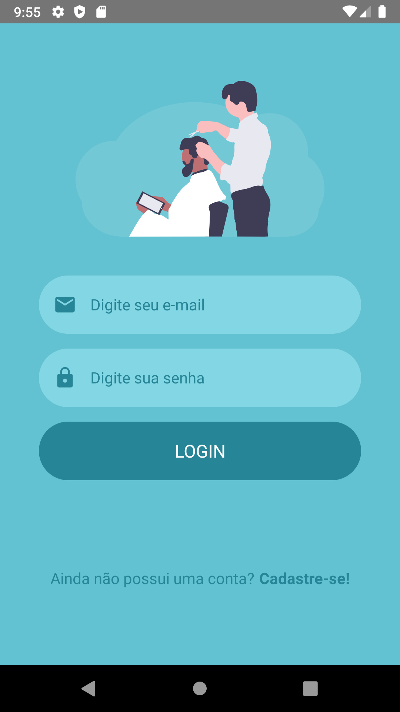
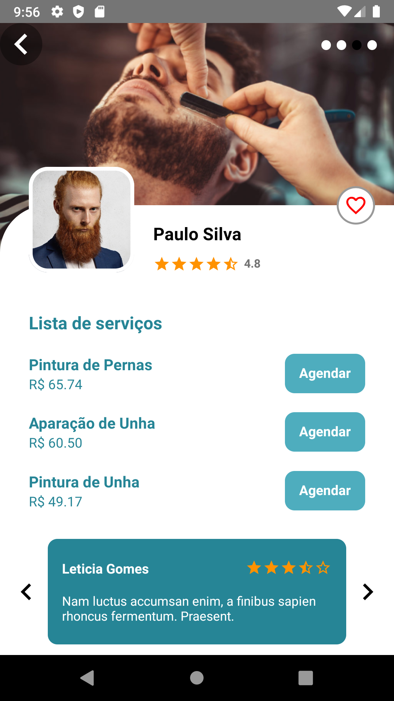
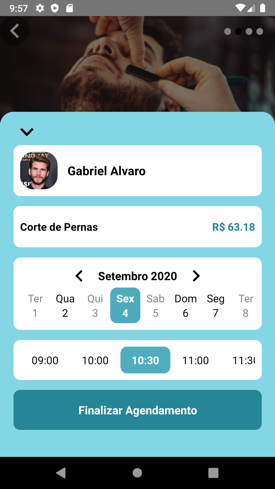

<h1 align="center">
  DevBarber
</h1>

## Project 💻

<h3 align="center">
  A mobile app developed with React Native.  
  Easy to find barbers of your region and make an appointment with your favorite barber.  
  This app can be adapted for any service segment.  
</h3>

## 🎨 Layout

    
    
    
    

## Technologies

Technologies used to develop this app

- [ReactJS](https://reactjs.org/)
- [TypeScript](https://www.typescriptlang.org/)
- [React Router DOM](https://reacttraining.com/react-router/)
- [React Icons](https://react-icons.netlify.com/#/)
- [Styled Components](https://styled-components.com/)
- [Async Storage](https://reactnative.dev/docs/asyncstorage)
- [Geolocation](https://reactnative.dev/docs/geolocation.html)
- [React Native SVG](https://github.com/react-native-community/react-native-svg)
- [Metro](https://facebook.github.io/metro/)
- [Eslint](https://eslint.org/)

## Getting started

First you need to have node or yarn installed on your machine.
Then, you can clone this repository and run the following commands inside the project root:

1. `yarn start`;

## 📝 License

This project is licensed under the MIT License - see the [LICENSE](LICENSE) file for details.

---

Made with 💙 by Carlos Eduardo Silva [See my linkedin](https://www.linkedin.com/in/carlos-silva-devs/)
